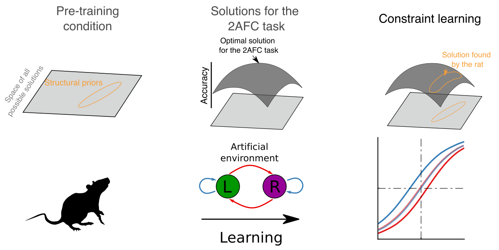

<p align="center">
    
<p>

### Recurrent networks endowed with structural priors explain suboptimal animal behavior

This repository contains the code necessary to train RNNs as we do in [Molano-Mazon et al. 2023 Current Biology](https://www.sciencedirect.com/science/article/abs/pii/S0960982222019819). 


Documentation: 
- [Installation](#Installation)
- [Tasks](#Tasks)
- [Wrappers](#Wrappers)
- [Examples](#Examples)
- [Authors](#Authors)

The tasks inherit all functionalities from the original [NeuroGym](https://github.com/neurogym/neurogym) toolkit and thus in corporate its flexibility to modify the tasks. The repository also incorporates several various modifier functions (wrappers) that allow easy configuration of new tasks. 


### Installation

The training of the RNNs was developed using TensorFlow 1.13, which means you may need to install older versions of certain libraries for it to function properly (I apologize for this). The main dependencies are: 
- [Python](https://www.python.org) version 3.7	
- [Tensorflow](https://www.tensorflow.org/) version 1.13.1
- [Stable baselines,  version 2.0](https://github.com/hill-a/stable-baselines), Do this: ```pip install tensorflow==1.13.1 stable-baselines==2.10.2```
- [Neurogym](https://neurogym.github.io/)

You might also have to modify the protobuf version:
```
pip install protobuf==3.20.0 opencv-python-headless
```

You can install the tasks as follows (see also [NeuroGym](https://github.com/neurogym/neurogym)):

    git clone https://github.com/manuelmolano/structural_priors_paper.git
    cd structural_priors_paper/ngym_priors
    pip install -e .
    

### Tasks
The environment used for the paper is: [nalt_perceptualdecisionmaking](https://github.com/manuelmolano/structural_priors_paper/blob/master/ngym_priors/ngym_priors/envs/nalt_perceptualdecisionmaking.py).

### Wrappers
[Wrappers](https://github.com/manuelmolano/structural_priors_paper/tree/master/ngym_priors/ngym_priors/wrappers) are short scripts that allow introducing modifications the original tasks. 
The main wrappers used are:
- TrialHistoryEv: to define the contexts.
- Variable_nch: to specify the number of choices.
- MonitorExtended: to save the behavioral data.
- PassAction: to pass the previous action as an input (this wrapper is already present in the original NeuroGym toolbox)
- PassReward:  to pass the previous reward as an input (this wrapper is already present in the original NeuroGym toolbox)

### Examples
The following example will train and test an RNN on the 2AFC task. Note that the file [params.py](https://github.com/manuelmolano/structural_priors_paper/blob/master/priors/params.py) is expected to be in the folder where you will save the behavioral data.
```
python bsc_run.py --folder /home/folder_where_you_want_to_save_the_behavioral_data --seed 0 --alg ACER --n_ch 2
```


### Authors
* Contact

    [Manuel Molano](https://github.com/manuelmolano) (manuelmolanomazon@gmail.com).
  
